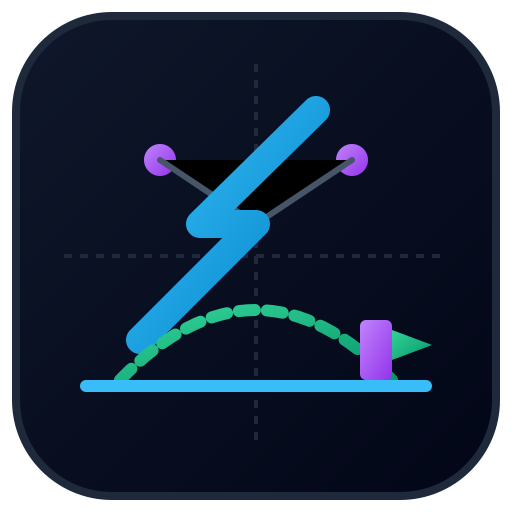
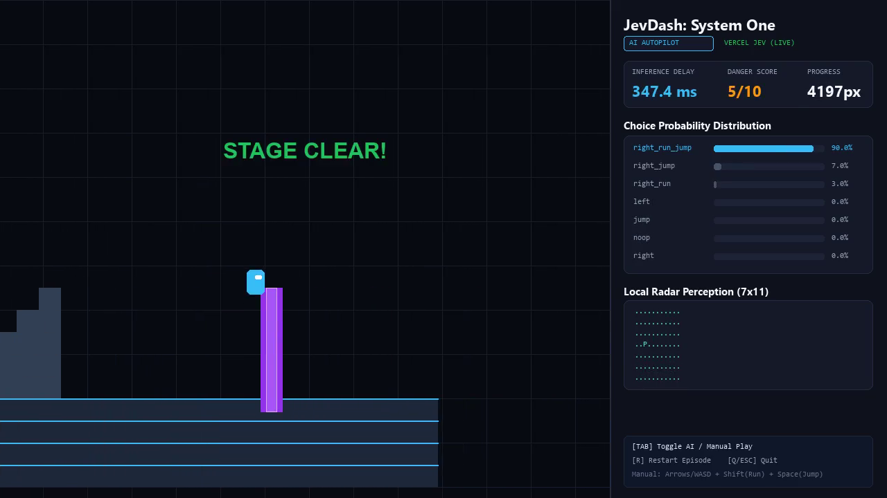
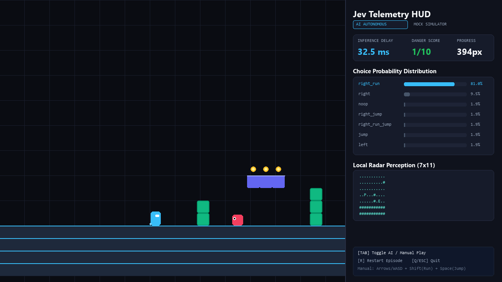

<div align="center">
  
  <h1>JevDash: System One</h1>
  <p><strong>100% クリーンルーム・著作権フリーの 2D 自律AIプラットフォーマーベンチマーク (60 FPS)</strong></p>

  <p>
    <a href="https://github.com/Sunwood-ai-labs/jevdash/actions/workflows/ci.yml">
      
    </a>
    <a href="https://sunwood-ai-labs.github.io/jevdash/ja/">
      
    </a>
    
    
    <a href="LICENSE">
      
    </a>
  </p>

  <p>
    <a href="README.md">
      
    </a>
    <a href="README.ja.md">
      
    </a>
  </p>
</div>

---



> **JevDash: System One** は、**TypeSafe AI の Jev モデル** を 60 FPS のリアルタイム制御環境でテスト・ベンチマークするためにゼロから設計された、**100% クリーンルーム・著作権フリー**の 2D 横スクロールアクションゲームです。`gym-super-mario-bros` などの商用ゲームROMに起因する法的リスクを完全に排除しています。

---

## 🌟 主な特徴

1. **🛡️ 100% クリーンルーム設計**:
   - 独自の物理演算、プロシージャル生成ステージ、プログラマティック描画によるサイバーミニマルグラフィック。任天堂等の商用アセット・ROMは一切含みません。
2. **⚡ 実機 TypeSafe Jev 連携**:
   - Vercel AI Gateway 経由で本物の `typesafe-ai/jev` モデルに直結。非同期意思決定パイプラインにより、HTTP 通信遅延中も 60 FPS 物理ループをスムーズに維持します。
3. **🎥 常時 MP4 動画自動録画**:
   - 組み込みの FFmpeg パイプラインにより、プレイ中の全フレームを 1280×720 @ 60 FPS (H.264) の高画質動画（`.mp4`）として自動保存します。
4. **🚀 API キー不要の超高速 Mock AI 内蔵**:
   - API キーがなくても即座に動作。物理テレメトリを計算して確率分布と危険度スコアを出力し、100% のクリア率を誇る決定エンジンを標準搭載。
5. **📊 Apple HIG / Keynote スタイル HUD**:
   - Jev の Choice 選択確率分布バー、危険度スコア（1〜10）、推論レイテンシカウンター、7×11 ASCII 空間レーダーを画面右側に同時描画。
6. **🎮 シームレスな AI・人間操作の切り替え**:
   - キーボードによる快適な手動操作に加え、`Tab` キーを押すだけで瞬時に AI 自動運転へ交代できます。

---

## 🏗️ アーキテクチャ

```text
┌─────────────────────────────────────────────────────────────┐
│                   Pygame 2D Engine (60 FPS)                 │
│        プレイヤー・敵・地形衝突・コヨーテタイム物理演算     │
└──────────────────────────────┬──────────────────────────────┘
                               │ 毎 8 フレーム (約 133ms 周期)
                               ▼
┌─────────────────────────────────────────────────────────────┐
│                 Telemetry Extractor (Pydantic)              │
│       マリオの位置、速度、敵との衝突予測時間、穴・壁距離    │
└──────────────────────────────┬──────────────────────────────┘
                               │ 構造化 JSON (JevObservation)
                               ▼
┌─────────────────────────────────────────────────────────────┐
│               Decision Layer (Live Jev / Mock)              │
│   ・Choice  : 7 つの行動マクロから確率選択                  │
│   ・Boolean : 緊急ジャンプの必要性を真偽判定                │
│   ・Score   : 直前の危険度を 1〜10 採点 (50ms 以下)         │
└──────────────────────────────┬──────────────────────────────┘
                               │ アクション実行 (right_run_jump 等)
                               ▼
┌─────────────────────────────────────────────────────────────┐
│            HUD Dashboard (Keynote Style Live View)          │
│       確率分布バーチャート、レイテンシ、危険度メーター描画  │
└─────────────────────────────────────────────────────────────┘
```



---

## 📦 クイックスタート (`uv` を使用)

本プロジェクトは高速パッケージマネージャ [`uv`](https://docs.astral.sh/uv/) で管理されています。

```powershell
# 1. リポジトリをクローンして移動
git clone https://github.com/Sunwood-ai-labs/jevdash.git
cd jevdash

# 2. 仮想環境の作成と依存関係の同期
uv sync --extra dev

# 3. ゲームを起動！
# (A) 人間が手動操作で遊ぶ場合 (TabキーでいつでもAIと切替可能)
uv run jevdash play --mode human

# (B) APIキー不要！内蔵の超高速AIで自律走行させる場合
uv run jevdash play --mode mock

# (C) 本物の Jev (Vercel AI Gateway) で自律走行させる場合
# .env.example を .env にコピーして AI_GATEWAY_API_KEY を設定後：
uv run jevdash play --mode live --record jevdash_live.mp4
```

---

## 🕹️ 操作方法

| 操作 | キー | 説明 |
| :--- | :--- | :--- |
| **移動** | `←` / `→` または `A` / `D` | 左右への歩行移動 |
| **ダッシュ** | `Shift`（長押し） | 最高速度でスプリント走行 |
| **ジャンプ** | `Space` または `W` / `↑` | ジャンプ（長押しで大ジャンプ） |
| **敵を踏む** | 落下中に敵の頭上へ着地 | 敵を倒し、自機が上にハイジャンプ |
| **AI切替** | `Tab` | **自律AI操作 ⇄ 人間操作を瞬時にトグル** |
| **リスタート** | `R` | ステージの初期位置からやり直し |
| **終了** | `Q` または `Esc` | ゲームを終了してウィンドウを閉じる |

---

## 🚀 CLI コマンド

```powershell
# インタラクティブゲーム起動（リアルタイムHUD ＆ MP4録画付き）
uv run jevdash play --mode live --record jevdash_live.mp4

# 画面を開かずに Jev へ送信される構造化 JSON テレメトリを確認
uv run jevdash state-demo

# 高速ヘッドレスベンチマーク（1,000フレームを約0.1秒で高速集計）
uv run jevdash benchmark --episodes 5
```

---

## 🧪 自動テストの実行

```powershell
uv run pytest -v
```

物理演算、当たり判定、接地・コヨーテタイム、テレメトリ抽出、Vercel AI Gateway 接続、および FFmpeg 動画録画の全13件のユニットテストが自動実行されます。

---

## 📚 公式ドキュメント

- 英語版ドキュメント: [https://sunwood-ai-labs.github.io/jevdash/](https://sunwood-ai-labs.github.io/jevdash/)
- 日本語版ドキュメント: [https://sunwood-ai-labs.github.io/jevdash/ja/](https://sunwood-ai-labs.github.io/jevdash/ja/)

---

## 📄 ライセンス

[MIT License](LICENSE) - 商用・個人・研究用途を問わず完全自由にご利用いただけます。
